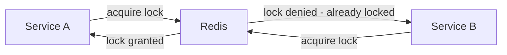

# 🔐 Distributed Locks

A **Distributed Lock** is a mechanism used to ensure that only one process in a distributed system can access a shared resource at a time. Unlike a standard mutex in a single application, distributed locks work across multiple servers or containers.

### Why do you need it?

* **Efficiency:** To avoid doing the same work twice (e.g., triggering an expensive report calculation).
* **Correctness:** To prevent data corruption or race conditions (e.g., preventing two users from booking the same seat simultaneously).


---

## The Architecture

In a distributed environment, you cannot rely on local memory. You need a shared "source of truth"—usually **Redis**, **ZooKeeper**, or **Etcd**.




### Key Requirements


1. **Mutual Exclusion:** Only one client can hold the lock.
2. **Deadlock Free:** The lock must expire (TTL) even if the client crashes.
3. **Fault Tolerance:** The lock mechanism shouldn't fail if a single node goes down.


---

## Real-World Example: Node.js with Redis

The most common way to implement this in Node.js is using the **Redlock** algorithm via the `redlock` library.

### Scenario: Preventing Double Payments

When a user clicks "Pay" twice rapidly, we want to ensure the transaction only processes once.

```javascript
import Redis from "ioredis";
import Redlock from "redlock";

const redis = new Redis({ host: "localhost" });
const redlock = new Redlock([redis], {
  retryCount: 10,
  retryDelay: 200, // time in ms
});

async function processPayment(userId, amount) {
  const resource = `locks:payment:${userId}`;
  const ttl = 5000; // 5 seconds

  try {
    // 1. Acquire the lock
    let lock = await redlock.acquire([resource], ttl);
    
    try {
      console.log(`Processing payment for ${userId}...`);
      // Perform DB operations here
      await executeTransaction(userId, amount);
    } finally {
      // 2. Release the lock
      await lock.release();
    }
  } catch (err) {
    console.error("Could not acquire lock, payment already in progress.");
  }
}
```


---

## Best Practices

| **Feature** | **Description** |
|---------|-------------|
| **TTL (Time to Live)** | Always set a timeout. If your process crashes, the lock will automatically release. |
| **Unique IDs** | Use a unique value (like a UUID) to ensure a client only releases the lock it actually owns. |
| **Drift Compensation** | Account for clock drift between servers when calculating lock expiration. |

### Common Pitfalls

* **Setting TTL too short:** The lock might expire while the process is still running.
* **Ignoring Network Partitions:** In a split-brain scenario, two nodes might think they own the lock. Use **Redlock** for better safety across multiple Redis nodes.