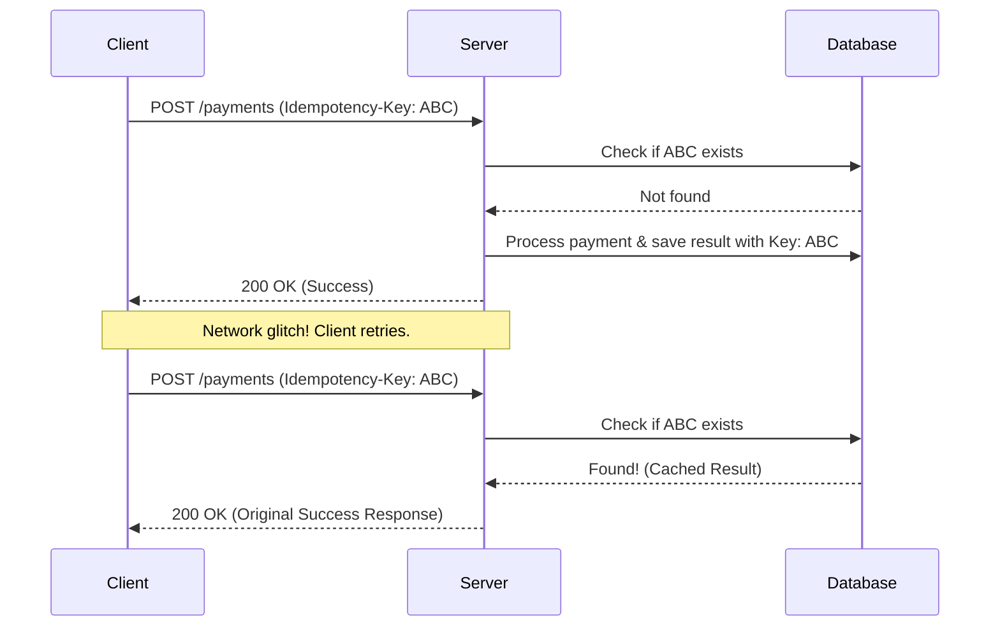

# 🗝️ Idempotency Keys

An **Idempotency Key** is a unique identifier sent by a client to an API to ensure that an operation happens only once, even if the request is retried multiple times. This is critical in distributed systems to prevent duplicate actions, like charging a customer twice for a single order.


---

### How It Works


1. **The client** generates a unique string (usually a UUID) for a specific operation.
2. **The client** sends the request with the `Idempotency-Key` header.
3. **Server** checks if it has seen this key before:
   * **New Key:** Server processes the request and stores the result alongside the key.
   * **Duplicate Key:** Server skips processing and returns the **cached response** from the first successful request.


---

### Example Request

```http
POST /v1/payments
Host: api.example.com
Idempotency-Key: 550e8400-e29b-41d4-a716-446655440000
Content-Type: application/json

{
  "amount": 1000,
  "currency": "usd"
}
```

### Visual Workflow




---

### Key Best Practices

* **Expiration:** Store keys for a limited time (e.g., 24 hours) to avoid bloating your database.
* **Scope:** Keys should be unique per user or account to avoid collisions.
* **Error Handling:** If a request fails with an `4xx` error due to bad data, the server should typically not cache that result, allowing the client to fix the payload and try again with the same key.
* **Deterministic Responses:** Always return the exact same status code and body for a reused key.