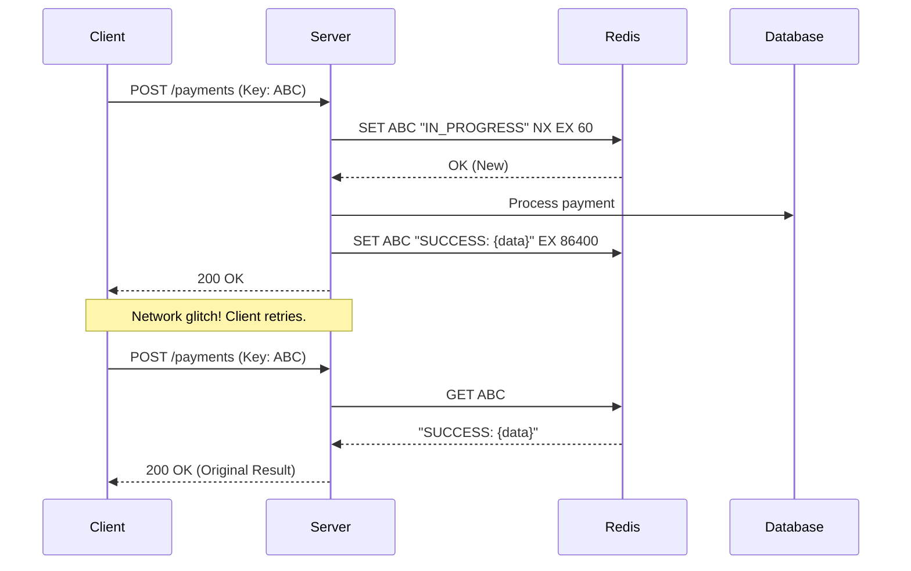

# 🗝️ Idempotency Keys

An **Idempotency Key** is a unique identifier sent by a client to an API to ensure that an operation happens only once, even if the request is retried multiple times. This is critical in distributed systems to prevent duplicate actions, like charging a customer twice for a single order.


## How It Works

1. **The client** generates (or the server derives) a unique identifier for a specific operation.
2. **The key** is either sent in the request (e.g., `Idempotency-Key` header) or derived by the server from the request properties.
3. **The Server** checks a central store to see if it has seen this key before:
   * **New Key:** Server processes the request and stores the result alongside the key.
   * **Duplicate Key:** Server skips processing and returns the **cached response** from the first successful request.


## Generation Strategies

### 1. Client-Side Generation (Common)
The client generates a unique identifier for a specific operation.
* **Pros:** Simplest for the server; allows the client to retry the exact same operation after a timeout.
* **Cons:** Malicious users can reuse idempotency keys to bypass logic, or buggy clients might use the same key for different operations.

### 2. Server-Side Derivation (Request Fingerprinting)
The server generates a unique identifier based on the request properties: `hash(User-ID + Method + Path + Request-Body)`.
* **Pros:** Doesn't rely on the client's honesty; prevents accidental duplicates even if the client doesn't support headers.
* **Cons:** Requires a "time window" (TTL) to allow the same user to genuinely perform the same action later.


## Storage & Distributed Systems

In modern architectures with multiple server instances, the idempotency store **must be shared**.

* **Standard Choice:** **Redis** or a similar key-value store.
* **Why:** You need sub-millisecond lookups and atomic operations (like `SET NX`).
* **Process:**
  1. Server receives request.
  2. Server attempts to claim the key in Redis with a TTL.
  3. If the key already exists, return the stored result.
  4. If not, proceed with the operation and update the key with the final result (e.g., status "SUCCESS" and the response body).

## Example Request

```http
POST /v1/payments
Host: api.example.com
Idempotency-Key: 550e8400-e29b-41d4-a716-446655440000
Content-Type: application/json

{
  "amount": 1000,
  "currency": "usd"
}
```

### Visual Workflow


```mermaid
sequenceDiagram
    participant Client
    participant Server
    participant Redis
    participant Database

    Client->>Server: POST /payments (Key: ABC)
    Server->>Redis: SET ABC "IN_PROGRESS" NX EX 60
    Redis-->>Server: OK (New)
    Server->>Database: Process payment
    Server->>Redis: SET ABC "SUCCESS: {data}" EX 86400
    Server-->>Client: 200 OK

    Note over Client, Server: Network glitch! Client retries.

    Client->>Server: POST /payments (Key: ABC)
    Server->>Redis: GET ABC
    Redis-->>Server: "SUCCESS: {data}"
    Server-->>Client: 200 OK (Original Result)
```

## When to Use It

| **Apply (Critical Operations)** | **Skip (Non-Critical)** |
|---|---|
| **Financial Transactions:** Payments, transfers, refunds. | **Read Operations:** GET requests are idempotent by design. |
| **Inventory Management:** Decrementing stock or reserving items. | **Idempotent Updates:** PUT requests that overwrite a resource. |
| **Resource Creation:** POSTs that create unique records (e.g., `create_user`). | **Analytics/Logging:** Where a duplicate entry is acceptable. |
| **External API Calls:** Sending emails or SMS via third-party providers. | **Frequently Changing Data:** Heartbeats or real-time status updates. |


## Key Best Practices

* **Expiration:** Store keys for a limited time (e.g., 24 hours) to avoid bloating your store.
* **Scope:** Keys should be unique per user or account to avoid collisions.
* **Error Handling:** If a request fails with an `4xx` (bad request), do not cache the result. Allow the client to fix the payload and try again with the same key.
* **Atomicity:** Ensure the check-then-set operation is atomic to prevent race conditions where two identical retries are processed at the exact same time.