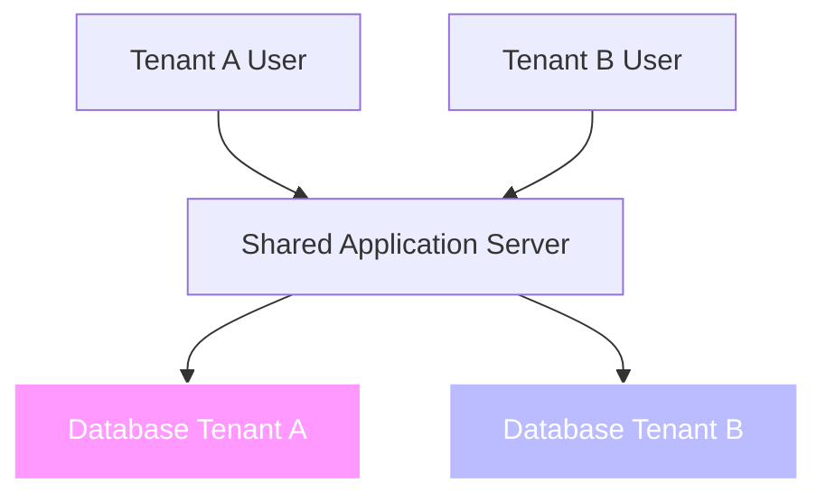
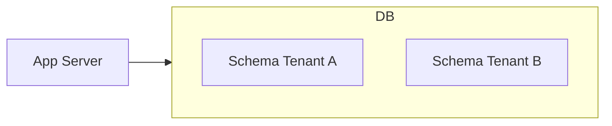
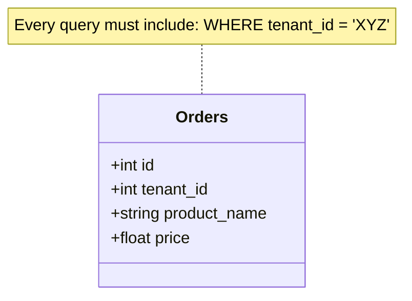
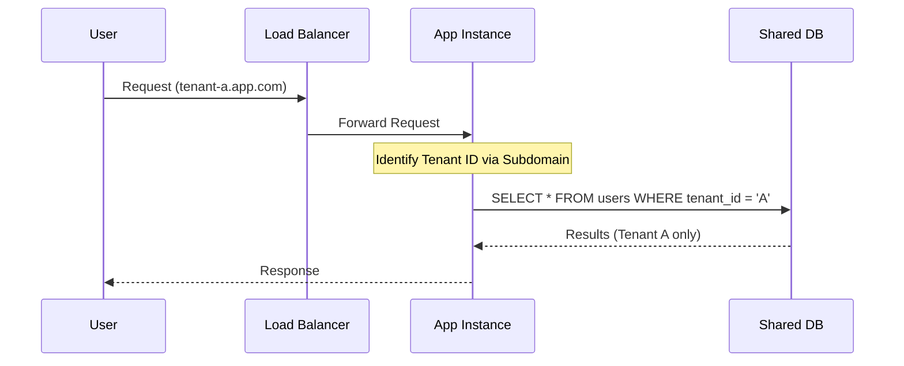

# 🏢 Multi-tenancy

**Multi-tenancy** is an architecture where a single instance of a software application serves multiple customers, known as **tenants**. Each tenant’s data is isolated and remains invisible to other tenants, even though they are running on the same infrastructure.

## Core Concepts

In a multi-tenant system, the goal is to balance **resource efficiency** (sharing costs) with **data security** (isolation).

* **Tenant:** A group of users (typically an organization) sharing common access with specific privileges.  
* **Isolation:** The degree to which tenants are separated.  
* **Scalability:** The ability to add more tenants without a linear increase in infrastructure costs.

## Architectural Models

There are three primary ways to handle data in multi-tenancy:

### A. Shared Application, Separate Databases

Each tenant has its own physical database. This provides the highest level of isolation.

### B. Shared Application, Shared Database (Schema Separation)

Tenants share a database but have their own **Schemas** (PostgreSQL) or **Prefixes**.

### C. Shared Database, Shared Schema (Discriminator Column)

All data lives in the same tables. A tenant_id column is used to filter data for each request. This is the most cost-effective but requires rigorous security at the code level.

## The Shared Infrastructure Flow

Most modern SaaS applications use a shared load balancer and application tier, routing traffic based on the **Tenant Context** (usually derived from a Subdomain or JWT claim).

## Pros and Cons

| Feature | Multi-Tenancy | Single-Tenancy |
| :---- | :---- | :---- |
| **Cost** | **Lower** (shared resources) | **Higher** (dedicated resources) |
| **Maintenance** | **Easy** (update once for all) | **Hard** (update each instance) |
| **Security** | Requires strict logic | Physical isolation |
| **Customization** | Limited (shared codebase) | High (bespoke versions) |

## Implementation Best Practices

1. **Context Injection:** Use middleware to extract the tenant_id early in the request lifecycle and store it in a thread-local variable or "Async Local Storage."  
2. **Database Migrations:** Ensure your migration tool can run updates across all tenant schemas/databases simultaneously.  
3. **Noisy Neighbor Protection:** Implement rate limiting per tenant so one high-usage customer doesn't slow down the system for others.  
4. **Row-Level Security (RLS):** If using PostgreSQL, leverage RLS to enforce isolation at the database level rather than just the application code.
