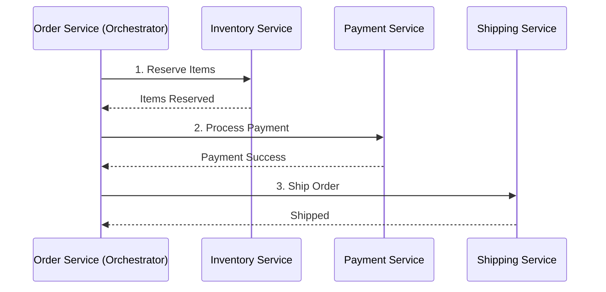
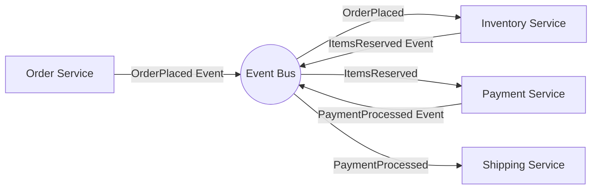
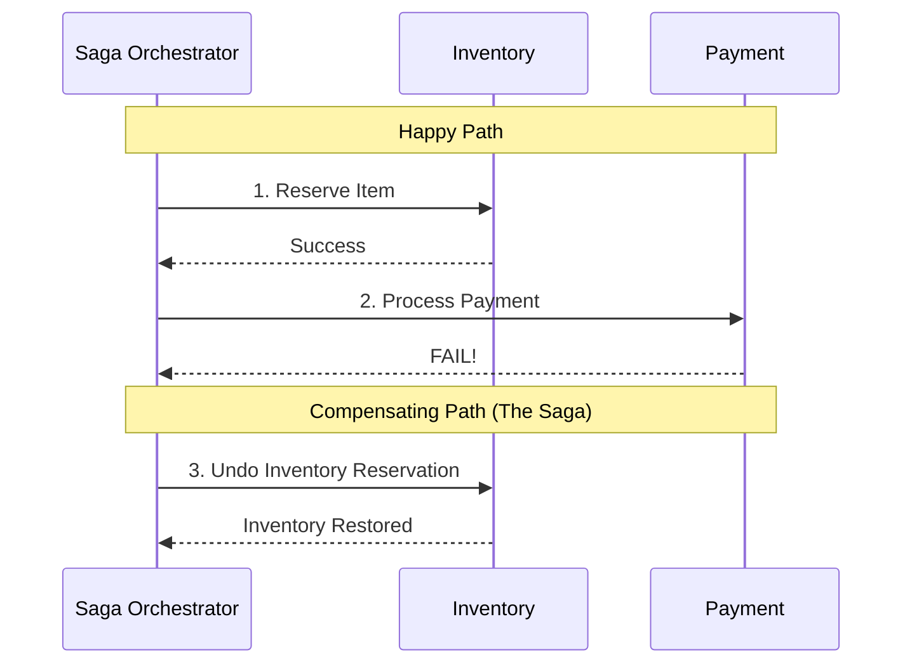
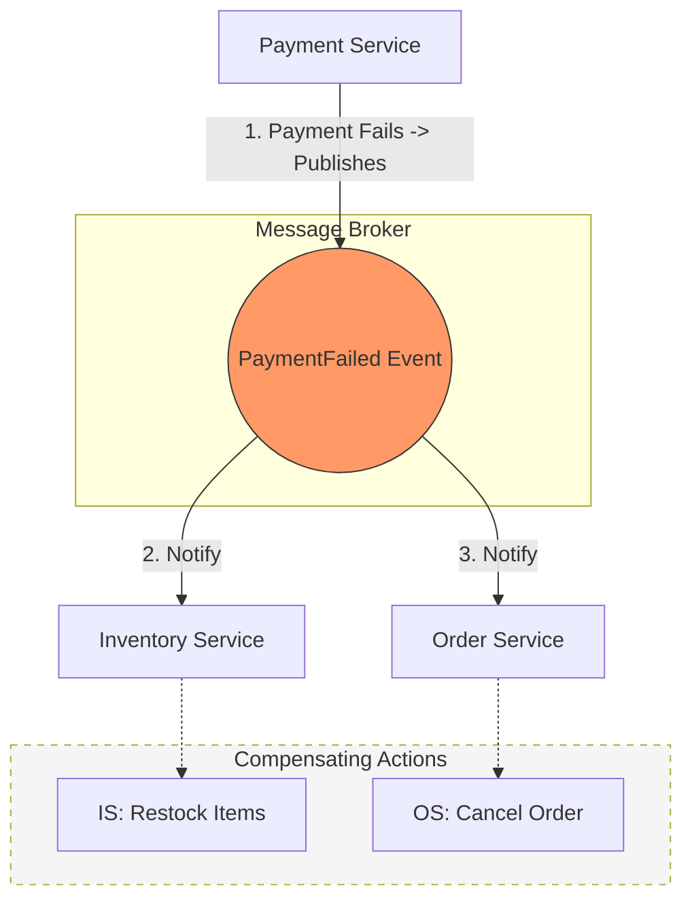

# 🎶 Orchestration vs. Choreography

In microservices architecture, managing communication between services is crucial. There are two primary ways to handle these interactions: **Orchestration** and **Choreography**.

---

## Orchestration (The Conductor)

In the Orchestration pattern, a **central controller** (the "Orchestrator") **acts as the brain**. It tells each service what to do and when to do it. **If a service fails, the orchestrator is responsible for handling the error or managing retries**.

### How it Works

Think of a symphony orchestra. Every musician looks at the conductor. The musicians don't talk to each other; they wait for the conductor's signal to play their part.

### Pros & Cons

* **Pros:** Centralized logic, easy to track the state of a process, simpler to implement complex workflows with many steps.
* **Cons:** The orchestrator can become a bottleneck; services are tightly coupled to the controller's logic.

---

## Choreography (The Dance)

In the Choreography pattern, there is **no central controller**. Instead, services communicate via **events**. Each service knows what to do when it hears a specific signal from another service.

### How it Works

Think of a dance troupe. There is no conductor. Each dancer knows that when their partner spins, it's their cue to jump. They react to the movements (events) of others.

### Pros & Cons

* **Pros:** Highly decoupled, faster performance (asynchronous), easier to add new services without changing existing ones.
* **Cons:** Harder to monitor the overall "big picture," debugging can be complex (requires distributed tracing), potential for "event spaghetti."

---

## Summary Comparison

| **Feature** | **Orchestration** | **Choreography** |
|---------|---------------|--------------|
| **Control** | Centralized (The Conductor) | Decentralized (The Dancers) |
| **Coupling** | Tighter (Services depend on Orchestrator) | Loose (Services depend on Events) |
| **Visibility** | High (State is in one place) | Low (Distributed across services) |
| **Failure Handling** | Managed by Orchestrator | Managed by each service (Sagas) |
| **Best For** | Complex business workflows | Highly scalable, evolving systems |

## How Saga Relates to Orchestration and Choreography

The Saga pattern isn't a third alternative; rather, it is **implemented using** one of the two patterns we discussed. You choose the "flavor" of your Saga based on your communication style.

### Orchestrated Saga (Centralized Control)

In this model, the **Orchestrator** acts as the Saga Manager. It tells Service A to "Do X." If Service A fails, the Orchestrator tells Service B to "Undo Y."

**When to use:** For complex workflows where you need a single "source of truth" for the transaction state.

### Choreographed Saga (Decentralized Events)

In this model, there is no manager. Services listen to events and decide if they need to trigger a "Success" action or a "Compensating" action based on what happened before them.

**When to use:** For simple workflows where high decoupling and performance are the priority.

### Comparison Summary

| **Feature** | **Orchestrated Saga** | **Choreographed Saga** |
|---------|-------------------|--------------------|
| **Logic Location** | Inside the Orchestrator | Spread across all services |
| **Visibility** | Easy to see the transaction status | Hard to see the full "saga" flow |
| **Complexity** | Becomes complex to maintain code | Becomes complex to trace events |
| **Coupling** | Orchestrator knows all services | Services only know events |