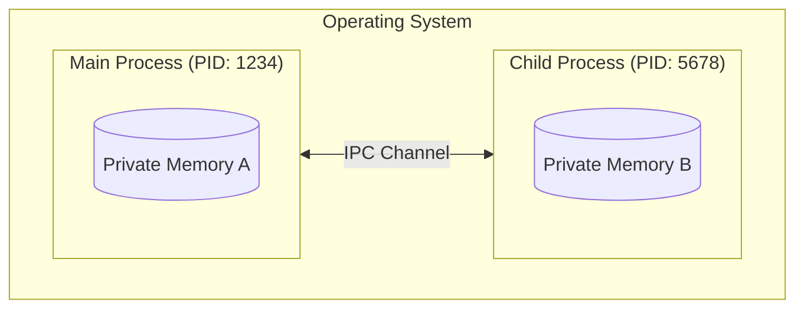
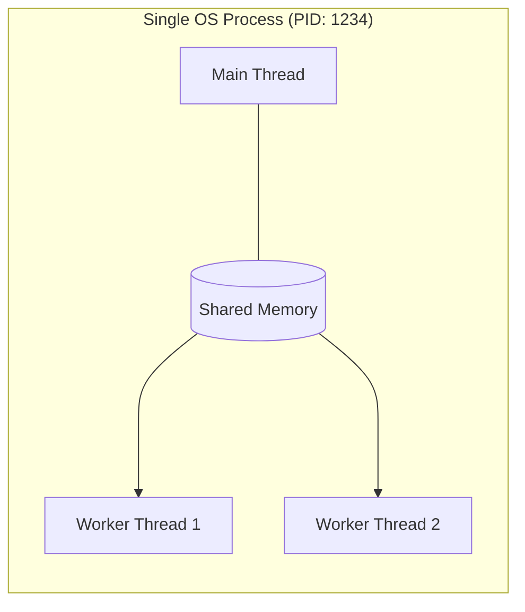

# 🛤️ Workers vs. Processes in Node.js

In Node.js, even though the main event loop is single-threaded, you can achieve parallelism using two primary methods: **Worker Threads** and **Child Processes**.

## Child Processes
A Child Process is a completely separate instance of the Node.js runtime. It has its own memory, its own V8 instance, and its own event loop.

* **Best for:** CPU-intensive tasks that are independent or involve executing external OS commands (like Python scripts or FFmpeg).
* **Communication:** Uses Inter-Process Communication (IPC).
* **Overhead:** High (memory-intensive).

```javascript
// parent.js
const { fork } = require('child_process');
const child = fork('task.js');

child.send({ start: true });
child.on('message', (result) => console.log('Result:', result));

// task.js
process.on('message', (msg) => {
  // Heavy computation here
  process.send({ done: true });
});
```



## Worker Threads
Worker Threads allow you to run JavaScript in parallel within the **same** process. Each worker has its own **V8 Isolate** and **Event Loop**, but they can share memory with the parent thread efficiently.

* **Best for:** CPU-bound JavaScript tasks (e.g., data processing, image resizing) where you want to avoid the overhead of a full process.
* **Communication:** `MessagePort` or shared memory via `SharedArrayBuffer`.
* **Overhead:** Low (shares the same process memory).

```javascript
const { Worker, isMainThread, parentPort } = require('worker_threads');

if (isMainThread) {
  const worker = new Worker(__filename);
  worker.on('message', (msg) => console.log('From Worker:', msg));
} else {
  // Perform heavy task
  parentPort.postMessage('Task Complete');
}
```



## ⚡ Quick Comparison

| Feature | Worker Threads | Child Processes |
| :--- | :---: | :---: |
| **Memory** | Shared (via SharedArrayBuffer) | Isolated (Separate) |
| **Isolation** | Low (crashing worker can impact process) | High (fault-tolerant) |
| **Startup Speed** | Fast | Slow |
| **Communication** | Very Fast (Memory pointers) | Slower (Serialization via IPC) |
| **Use Case** | Heavy JS Logic | External scripts / CLI tools |