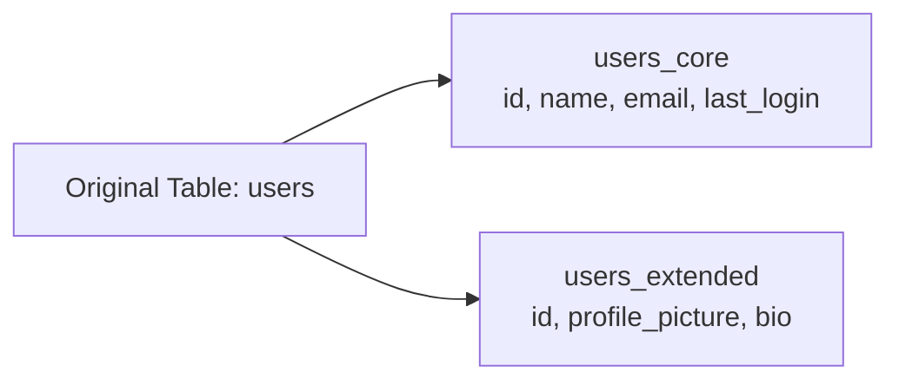
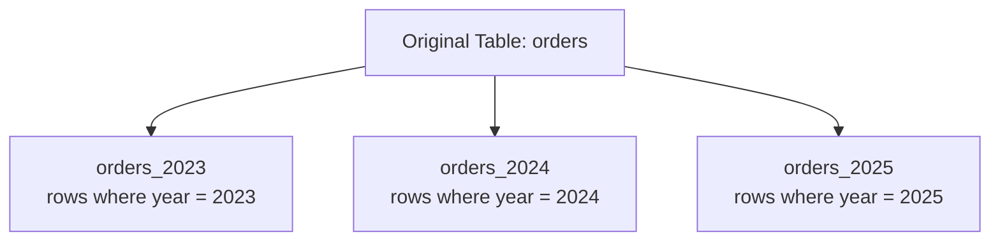
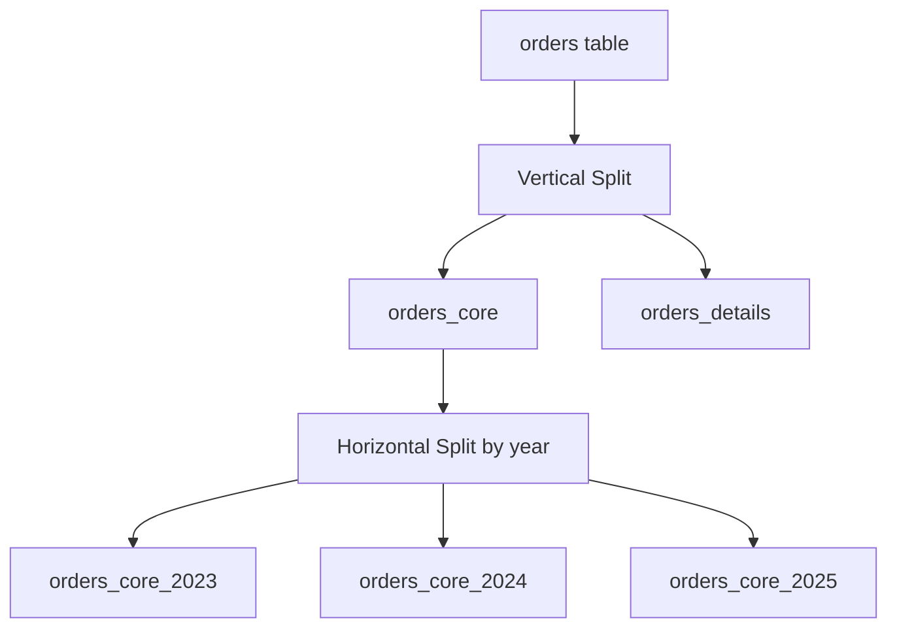

# Horizontal vs. Vertical Partitioning

## Overview

**Vertical Partitioning**:  Splits a table by **columns** (dividing attributes across multiple tables).

**Horizontal Partitioning**: Splits a table by **rows** (dividing data across multiple tables or databases).


---

## Vertical Partitioning

### Concept

Split columns into separate tables, typically separating frequently accessed data from rarely used data.

### Example

**Original Table:**

```sql
CREATE TABLE users (
    id INT PRIMARY KEY,
    name VARCHAR(100),
    email VARCHAR(100),
    profile_picture BLOB,
    bio TEXT,
    last_login TIMESTAMP
);
```

**After Vertical Partitioning:**

```sql
-- Frequently accessed data

CREATE TABLE users_core (
    id INT PRIMARY KEY,
    name VARCHAR(100),
    email VARCHAR(100),
    last_login TIMESTAMP
);

-- Rarely accessed data

CREATE TABLE users_extended (
    id INT PRIMARY KEY,
    profile_picture BLOB,
    bio TEXT,
    FOREIGN KEY (id) REFERENCES users_core(id)
);
```

### Diagram



### Benefits

* Improved cache efficiency
* Faster queries on frequently used columns
* Reduced I/O for common operations


---

## Horizontal Partitioning

### Concept

Split rows into separate tables based on a key (e.g., date, region, ID range).

### Example

**Original Table:**

```sql
CREATE TABLE orders (
    id INT PRIMARY KEY,
    user_id INT,
    order_date DATE,
    amount DECIMAL(10,2),
    region VARCHAR(50)
);
```

**After Horizontal Partitioning (by year):**

```sql
CREATE TABLE orders_2023 (
    id INT PRIMARY KEY,
    user_id INT,
    order_date DATE,
    amount DECIMAL(10,2),
    region VARCHAR(50)
);

CREATE TABLE orders_2024 (
    id INT PRIMARY KEY,
    user_id INT,
    order_date DATE,
    amount DECIMAL(10,2),
    region VARCHAR(50)
);

CREATE TABLE orders_2025 (
    id INT PRIMARY KEY,
    user_id INT,
    order_date DATE,
    amount DECIMAL(10,2),
    region VARCHAR(50)
);
```

### Diagram



### Benefits

* Better query performance (scan smaller datasets)
* Easier data archiving and deletion
* Improved scalability (can distribute across servers - sharding)


---

## Comparison

| Aspect | Vertical Partitioning | Horizontal Partitioning |
|--------|-----------------------|-------------------------|
| **Splits by** | Columns               | Rows                    |
| **Use case** | Separate hot/cold data | Large datasets, time-series data |
| **Query impact** | Fewer columns to scan | Fewer rows to scan      |
| **Joins** | More joins needed     | Queries may hit multiple partitions |
| **Scalability** | Limited               | High (enables sharding) |


---

## Combined Example




You can combine both strategies for maximum efficiency!